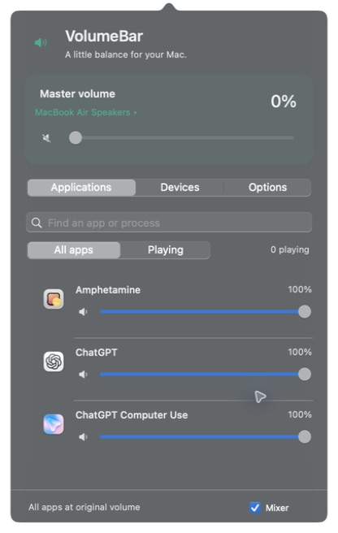

# VolumeBar 🎚️

**Every app, at the right volume.** A native macOS menu bar mixer with per-app volume, mute, and the usual master control. No audio driver to install.

[](https://github.com/pkyanam/VolumeBar/actions/workflows/ci.yml)
[](https://github.com/pkyanam/VolumeBar/releases/latest)
[](LICENSE)

## Install

**Requires an Apple Silicon Mac (M1 or newer) running macOS 14.4+.**

1. **[Download VolumeBar](https://github.com/pkyanam/VolumeBar/releases/latest/download/VolumeBar-arm64.dmg).**
2. Open the DMG and drag **VolumeBar** into **Applications**.
3. Open VolumeBar. Click the **speaker** icon in your menu bar.

Release downloads are Developer ID signed and notarized by Apple. For the newest development snapshot, see [all releases](https://github.com/pkyanam/VolumeBar/releases). CI artifacts are development builds, not notarized installers.

## First run

1. Play audio in an app, then move that app's slider in VolumeBar.
2. If macOS asks, allow **System Audio Recording**. This permission lets VolumeBar adjust sound; it does not save recordings.
3. If a slider says it is waiting for access, open **… → Audio recording permission…**, enable VolumeBar, then choose **Retry audio connections**. Restart VolumeBar if macOS requests it.

That's it. Levels are remembered. **… → Launch at login** is optional.

<p align="center"></p>

## What it does

- **Per-app volume and mute.** Quiet a browser without quieting your music. Recognizable helper processes share their app's slider.
- **Master volume.** Controls your current output device's system volume. The menu bar speaker shows mute and volume level, with the exact percentage and output in its tooltip.
- **Output picker.** Open **Devices** or click the output name. Switch connected speakers, headphones, AirPods, USB interfaces, and available AirPlay outputs. Star favorites to keep them first.
- **Independent microphone picker.** Keep headphones as output while selecting a different system input. Bluetooth users get a shortcut to the Mac microphone.
- **Device details.** See connection type, sample rate, and channels.
- **Set it and forget it.** App levels persist and apply when audio starts.
- **Find anything.** Filter to Playing, search app names or process IDs, or show background processes from the menu.
- **Instant bypass.** Switch **Mixer** off to restore normal app audio while keeping saved levels. Quitting also releases every app route.
- **Local audio only.** No microphone capture, saved audio, telemetry, or network requests.

## Devices

Connect your device in macOS first, then choose **Devices → Sound output**. The checkmark follows the actual system output, including changes made outside VolumeBar. Favorites are remembered by device identity and never switch audio automatically. The destination keeps its own volume; VolumeBar does not copy the old device's level.

The microphone menu changes the system default input without recording it. Apps with an explicit microphone choice may ignore that default. Using a Bluetooth microphone can reduce playback quality, so choosing the Mac microphone can help when listening through AirPods.

AirPods work as connected Bluetooth headphones in the picker. This release has no AirPods-specific controls: no battery readings, noise cancellation, spatial audio, or connect/disconnect actions. Device discovery uses public Core Audio APIs without private Bluetooth hooks, scanners, background helper processes, or added dependencies. Devices appear when macOS makes them available as audio endpoints.

## Good to know

VolumeBar is an early prototype. It currently supports mono/stereo Float32 outputs and up to 24 adjusted apps. Levels range from 0–100%; it does not boost sound above its original level.

- Some HDMI, Bluetooth, and USB outputs have no software master-volume control. Use their hardware controls.
- App audio intentionally routed to a different device is left alone.
- Protected media may not be capturable. VolumeBar waits for a valid signal before taking over an app's audio.
- Shared WebKit/system helper processes can appear separately. Browser tabs do not have separate sliders.
- Live audio was tested on macOS 26.6.2 with MacBook Air Speakers. Other devices and older supported macOS versions need more coverage.
- Intel users can [build a universal app](docs/development.md#intel-and-universal-builds). Published releases target Apple Silicon; see the [architecture decision](docs/distribution.md).

## Build from source

Install Xcode 16.4 or later, then:

```sh
git clone https://github.com/pkyanam/VolumeBar.git
cd VolumeBar
make install
```

This builds the app and opens it from `~/Applications`. No Homebrew packages or third-party Swift dependencies are required. For repeat builds, quit VolumeBar first.

```sh
make check   # DSP tests, release build, and app verification
make build   # dist/VolumeBar.app
make package # ZIP of the locally built app
```

Local builds use ad-hoc signing. Public releases use the automated Apple signing pipeline.

## Contributing and releases

- [Development guide](docs/development.md) — project layout, tests, and local builds.
- [Signing setup](docs/signing.md) — Apple credentials, GitHub secrets, and rotation.
- [Distribution and CI](docs/distribution.md) — release policy, safeguards, and Apple's current guidance.
- [Audio architecture](docs/architecture.md) — process taps and cleanup behavior.
- [Changelog](CHANGELOG.md) · [Security](SECURITY.md)

Every push and pull request runs tests and builds an app artifact. Trusted updates to `main` produce notarized prereleases when signing is configured. A `vX.Y.Z` tag matching `version.env` produces a stable release.

The repository organization takes inspiration from [Peter Steinberger's CodexBar](https://github.com/steipete/CodexBar): a native Swift package, straightforward build scripts, download-first documentation, and focused contributor guides. VolumeBar is an independent project.

MIT © Preetham Kyanam
